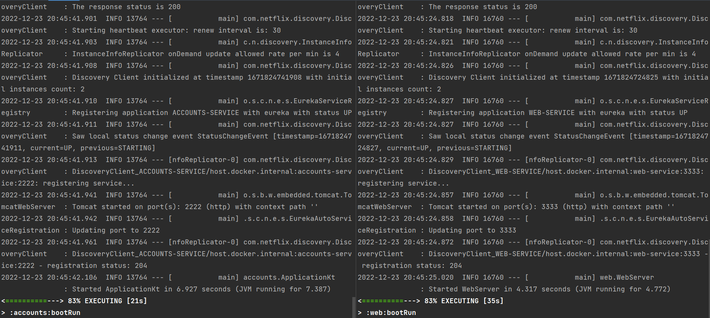
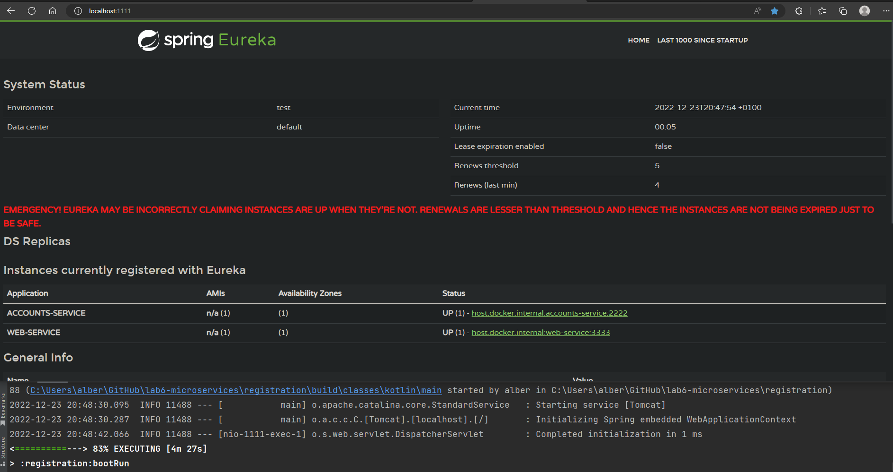
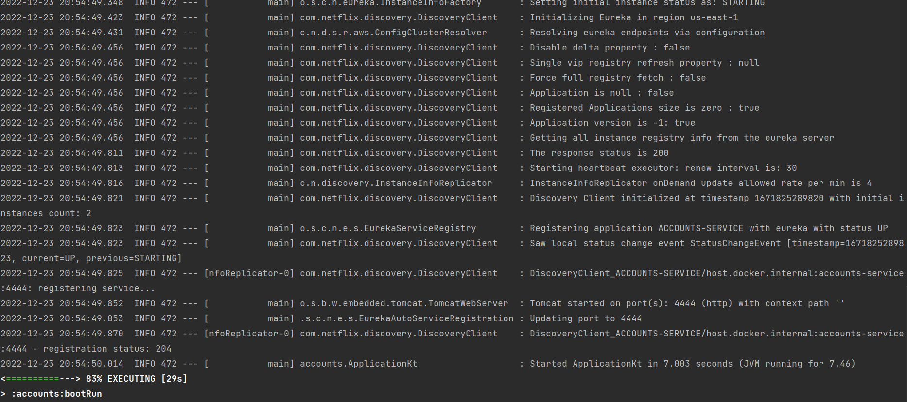
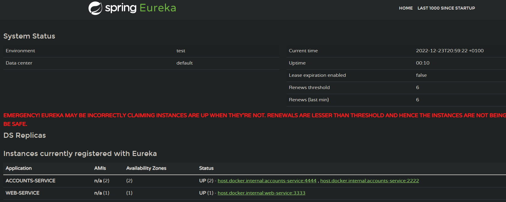
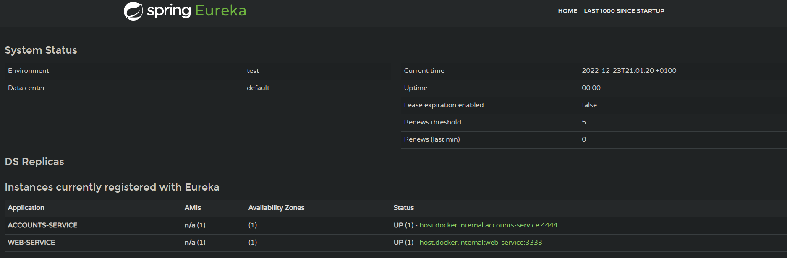
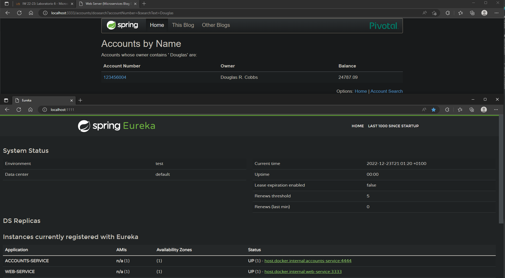

# REPORT
### - The two services `accounts (2222)` and `web` are running and registered (two terminals, logs screenshots).

### - The service registration service has these two services registered (a third terminal, dashboard screenshots)

### - A second `accounts` service instance is started and will use the port 4444. This second `accounts (4444)` is also registered (a fourth terminal, log screenshots).

### - What happens when you kill the service `accounts (2222)` and do requests to `web`? Can the web service provide information about the accounts again? Why?
We have both `accounts` services registered

We kill `accounts (2222)` (Uptime is 0 because I need to restart `registration` service to make `accounts (2222)` disappear from the dashboard)

Web still answers requests after killing `accounts (2222)` service

The web server can provide information about the accounts because Eureka looks for an available accounts service, it doesn't get stuck with the first `accounts` service registered

